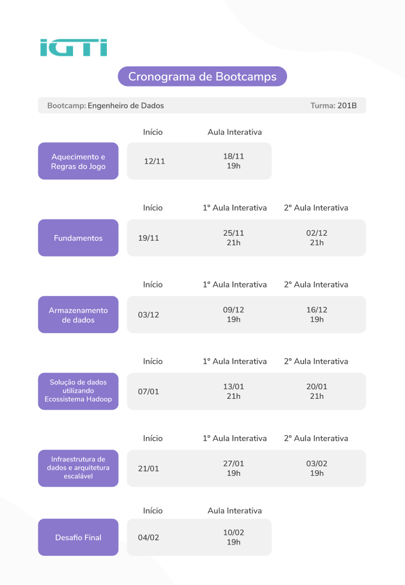

# Data Engineering Bootcamp IGTI
Repositório destinado aos meus estudos no bootcamp Engenharia de Dados do IGTI.
 
 

## 📅 Cronograma do Bootcamp

## 📚 Módulos

> 01. <b>Aquecimento e Regras do Jogo</b>
> - Visão geral da dinâmica do curso, conteúdos e ferramentas utilizadas.

> 02. <b>Fundamentos</b>
> - Conceitos fundamentais: Dados, fontes de dados, Big Data, tipos de dados. 
> - Visão geral do pipeline de ciência de dados: coleta, preparação, armazenamento, processamento/análise, visualização.
> -  Visão geral de soluções (plataformas, tecnologias) para extração, ingestão, transformação, armazenamento e análise de dados.
> - Fluxo de dados (data flow) ETL/ ELT (Extração, Transformação e Carga).
> -Implementação e automatização de ETL/ELT (data flow): Pentaho Data Integration, Apache NiFi e Apache Airflow.

> 03. <b>Armazenamento de dados</b>
> - Data warehouse e data lake: modelo, projeto, implementação, tecnologias envolvidas.
> -  Visão geral de SGBDs SQL(relacionais), NoSQL, NewSQL: o que é, diferenças e vantagens, ACID versus Teorema CAP / BASE, Categorias de SGBD NoSQL, Tecnologias existentes.
> -  Sistemas de arquivo: o que é, vantagens, tecnologias existentes. Armazenamento de dados em nuvem: SQL, NoSQL e sistemas de arquivos.
> -  Práticas: MySQL, PostGreSQL, Oracle ou SQL Server. Apache Hive.
> -  Práticas: MongoDB, Cassandra, HBase, Neo4j.
> -  Práticas demonstrativa: S3, Azure ou outro.

> 04. <b>Solução de dados utilizando Ecossistema Hadoop</b>
> - Introdução ao ecossistema Hadoop.
> - Modelagem de dados com Hadoop.
> - Ingestão de dados com Hadoop (Sqoop e Flume) e/ou Kafka).
> - Armazenamento de dados com Hadoop (HDFS e HBase).
> - Processamento de dados com Hadoop (Spark).

> 05. <b>Infraestrutura de dados e arquitetura escalável</b>
> - Serviços de conectividade, rede e segurança na Azure, AWS e GCP.
> - Exemplos de containers para Ciência de Dados e Machine Learnig.
> - Virtualização, containers e serviços de armazenamento.
> - Recursos para escalabilidade, elasticidade, alta disponibilidade e processamento distribuído.
> - Soluções para processamento de dados em larga escala. Modelos de serviços em nuvem: IaaS, PaaS, SaaS, etc.
> - Fundamentos de arquitetura escalável: Dimensionamento da arquitetura; > - Cálculo de capacidade, disponibilidade e desempenho; Mecanismos e técnicas de segurança; Escalonamento vertical e horizontal.
> - Requisitos arquiteturais: Nível de confiabilidade e escalabilidade; Carga de trabalho; Tipos e formatos dos dados; Complexidade dos dados; Fontes de dados; Nível de disponibilidade; Necessidades de integrações entre dados e fontes de dados; Mecanismos de acesso aos dados. 
> - Elementos que compões um projeto de arquitetura de dados.
Visão geral do conceito e práticas de DataOps e integração contínua de dados e ferramentas.
> - Soluções de automatização de data flows (Exemplo: Apache NiFi e/ou Airflow) 

> 06. <b>Fechamento</b>
> - Conclusão da aplicação final.